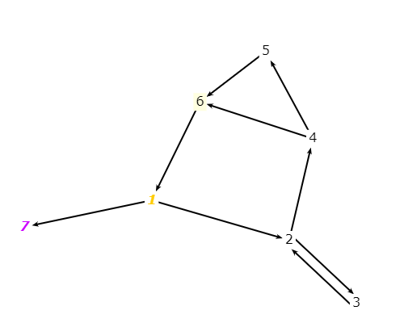

# Exercise 7.2.2-1
## Question
The graph defined by the following sets:
- N = {1, 2, 3, 4, 5, 6, 7}
- N0 = {1}
- Nf = {7}
- E = {(1, 2), (1, 7), (2, 3), (2, 4), (3, 2), (4, 5), (4, 6), (5, 6), (6, 1)}

Also consider the following (candidate) test paths:
- p1 = [1, 2, 4, 5, 6, 1, 7]
- p2 = [1, 2, 3, 2, 4, 6, 1, 7]
- p3 = [1, 2, 3, 2, 4, 5, 6, 1, 7]

## Answer
### (a) Draw the graph.

### (b) List the test requirements for Edge-Pair Coverage.
13 requirements are needed for Edge-Pairs:
1. [1,2,3]
2. [1,2,4]
3. [1,7]
4. [2,3,2]
5. [2,4,5]
6. [2,4,6]
7. [3,2,3]
8. [3,2,4]
9. [4,5,6]
10. [4,6,1]
11. [5,6,1]
12. [6,1,2]
13. [6,1,7]

### (c) Does the given set of test paths satisfy Edge-Pair Coverage? If not, state what is missing.
* p1 miss (2,3,2), (3,2,4), (2,4,6) and (4,6,1)
* p2 miss (2,4,5) and (4,5,6)
* p3 miss (4,6,1) and (2,4,6)

### (d) Consider the simple path [3, 2, 4, 5, 6] and test path [1, 2, 3, 2, 4, 6, 1, 2, 4, 5, 6, 1, 7]. Does the test path tour the simple path directly? With a sidetrip? If so, write down the sidetrip.

The test path does not tour the simple path directly. However, it tour the simple path with a sidetrip.
The side trip is [4,6,1,2,4]

### (e) List the test requirements for Node Coverage, Edge Coverage, and Prime Path Coverage on the graph.
* Node coverage: TR = {1,2,3,4,5,6,7}
* Edge coverage: TR = {(1,2), (1,7), (2,3), (2,4), (3,2), (4,5), (4,6), (5,6), (6,1)}

### (f) List test paths from the given set that achieve Node Coverage but not Edge Coverage on the graph.
* Test paths that achived Node coverage: p3 (p1 missed 3, p2 missed 5)
* p3 still not achived Edge coverage is (4,6) is missed

### (g) List test paths from the given set that achieve Edge Coverage but not Prime Path Coverage on the graph.
There no such given path achived Edge coverage