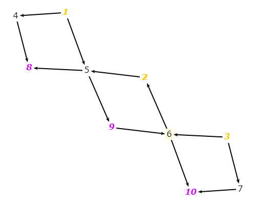

# Exercise 7.2.2-6
## The graph in Figure 7.2.

## a) List the test requirements for Node Coverage, Edge Coverage, and Prime Path Coverage on the graph.
* Node Coverage: TR = {1, 2, 3, 4, 5, 6, 7, 8, 9, 10}
* Edge Coverage: TR = {(1, 4), (1, 5), (2, 5), (3, 6), (3, 7), (4, 8), (5, 8), (5, 9), (6, 2), (6, 10), (7, 10), (9, 6)}
* Prime Path Coverage: TR = {[1, 4, 8], [1, 5, 8], [1, 5, 9, 6, 2], [1, 5, 9, 6, 10], [2, 5, 9, 6, 2], [2, 5, 9, 6, 10], [3, 6, 2, 5, 8], [3, 6, 2, 5, 9], [3, 6, 10], [3, 7, 10], [5, 9, 6, 2, 5], [6, 2, 5, 9, 6], [9, 6, 2, 5, 8], [9, 6, 2, 5, 9]}

## b) List test paths that achieve Node Coverage but not Edge Coverage on the graph.
* p1 = [1, 4, 8]
* p2 = [1, 5, 8]
* p3 = [2, 5, 9]
* p4 = [3, 6, 10]
* p5 = [3, 7, 10]

## c) List test paths that achieve Edge Coverage but not Prime PathCoverage on the graph.
* p6 = [3,6,2,5,9,6,10] T = {p1, p2, p5, p6} satisfies Edge Coverage