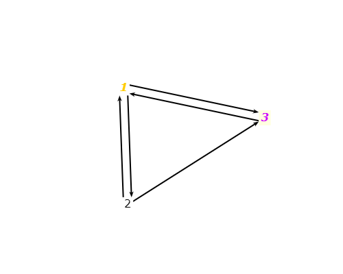

# Exercise 7.2.2-7
## Question
The graph defined by the following sets:
- N = {1, 2, 3}
- N0 = {1}
- Nf = {3}
- E = {(1, 2), (1, 3), (2, 1), (2, 3), (3, 1)}

Also consider the following (candidate) test paths:
- p1 = [1, 2, 3, 1]
- p2 = [1, 3, 1, 2, 3]
- p3 = [1, 2, 3, 1, 2, 1, 3]
- p4 = [2, 3, 1, 3]
- p5 = [1, 2, 3, 2, 3]

## Answer

### a) Which of the listed paths are test paths? For any path that is not a test path, explain why not.
* p1 and p4 are not test paths because they neither start at 1 nor end at 3.
* p5 is not a path since we have no edge (3,2).

### b) List the eight test requirements for Edge-Pair Coverage (only the length two subpaths).

1. [1,3,1]
2. [1,2,3]
3. [1,2,1]
4. [2,3,1]
5. [2,1,3]
6. [2,1,2]
7. [3,1,3]
8. [3,1,2]

### c) Does the set of test paths from part (a) above satisfy Edge-Pair Coverage? If not, state what is missing.
T = {p2, p3} does not satifies Edge-Pair Coverage since (2,1,2) is not covered

### d) Consider the prime path [3, 1, 3] and path p2. Does p2 tour the prime path directly? With a sidetrip?
p2 does not tour prime path [3,1,3] directly. However, it detour as [3,1,2,3]