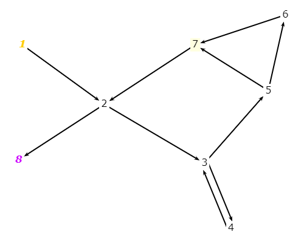
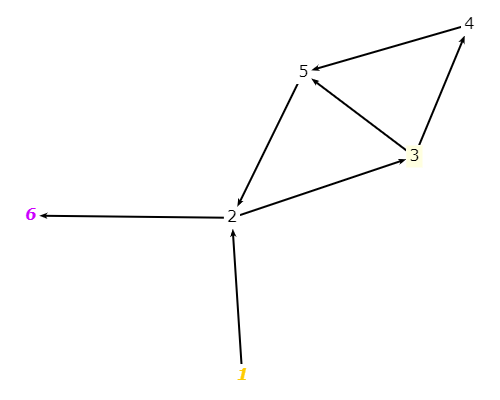
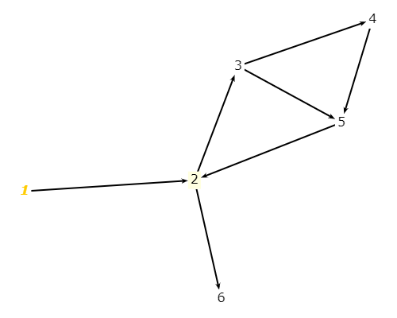
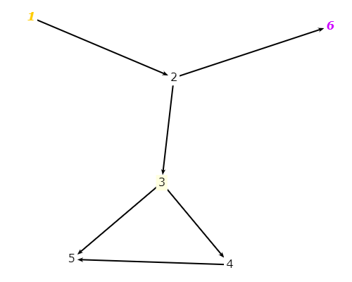

# Exercise 7.2.3-1
### a) Draw the graph.
* Graph 1:

* Graph 2:

* Graph 3:

* Graph 4:

### b) List all of the du-paths with respect to x.
* Graph 1:
  - dup1 [1, 2, 8]
  - dup2 [1, 2, 3, 5, 6]
  - dup3 [4, 3, 5, 6]
  - dup4 [4, 3, 5, 7, 2, 8]
  - dup5 [4, 3, 5, 6, 7, 2, 8]

* Graph 2:
  - dup1 [1,2,6]
  - dup2 [1,2,3]
  - dup3 [3,5,3]
  - dup4 [3,4,5,3]

* Graph 3:
No ending nodes. Cannot generate a set of test paths to satisfy the coverage.

* Graph 4:
  - dup1 [1,2,6]
  - dup2 [1,2,3,5]
  - dup3 [1,2,3,4,5]