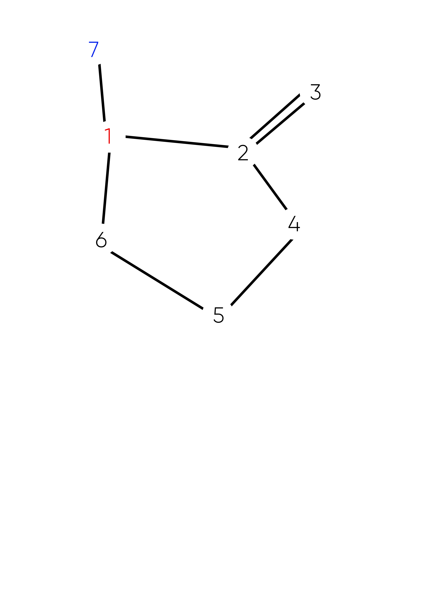

# Exercise 7.2.2.5
The graph defined by the following sets:
- N = {1, 2, 3, 4, 5, 6, 7}
- N0 = {1}
- Nf = {7}
- E = {(1, 2), (1, 7), (2, 3), (2, 4), (3, 2), (4, 5), (4, 6), (5, 6), (6, 1)}

Also consider the following (candidate) test paths:
- p1 = [1, 2, 4, 5, 6, 1, 7]
- p2 = [1, 2, 3, 2, 4, 6, 1, 7]
- p3 = [1, 2, 3, 2, 4, 5, 6, 1, 7]

## (a) Draw the graph.


## (b) List the test requirements for Edge-Pair Coverage.
* Test Requirement:
```
 [1,2,3] [1,2,4] [1,7] 
 [2,3,2] [2,4,5] [2,4,6] 
 [3,2,3] [3,2,4]
 [4,5,6] [4,6,1]
 [5,6,1]
 [6,1,2] [6,1,7]
```

### (c) Does the given set of test paths satisfy Edge-Pair Coverage? If not, state what is missing.
* p1 miss (2,3,2), (3,2,4), (2,4,6) and (4,6,1)
* p2 miss (2,4,5) and (4,5,6)
* p3 miss (4,6,1) and (2,4,6)

### (d) Consider the simple path [3, 2, 4, 5, 6] and test path [1, 2, 3, 2, 4, 6, 1, 2, 4, 5, 6, 1, 7]. Does the test path tour the simple path directly? With a sidetrip? If so, write down the sidetrip.
No
With a sidetrip: 
```
[6,1,2,4,5,6]
``` 

### (e) List the test requirements for Node Coverage, Edge Coverage, and Prime Path Coverage on the graph.
* TR node coverage: [1] [2] [7] [3] [4] [5] [6]

* TR edge coverage: [1,2] [1,7] [2,3] [2,4] [3,2] [4,5] [4,6] [5,6] [6,1]

* TR prime paths: [1,2,4,6,1] [1,2,4,5,6,1] [2,4,5,6,1,2] [2,4,6,1,2] [6,1,2,4,6] [4,6,1,2,3] [4,6,1,2,4] [3,2,3] [2,3,2] [3,2,4,5,6,1,7]  [3,2,4,6,1,7] [5,6,1,2,4,5] [6,1,2,4,5,6] [4,5,6,1,2,4] [4,5,6,1,2,3]

### (f) List test paths from the given set that achieve Node Coverage but not Edge Coverage on the graph.
* Test Path 3 achived Node coverage but not achived Edge coverage. 

### (g) List test paths from the given set that achieve Edge Coverage but not Prime Path Coverage on the graph.
None path achived EC but not PPC.
 