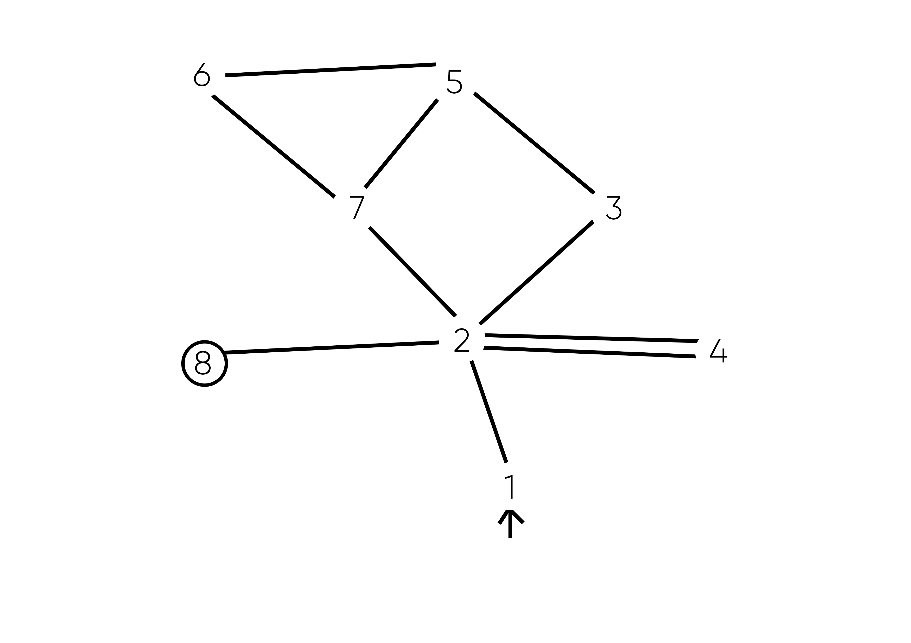
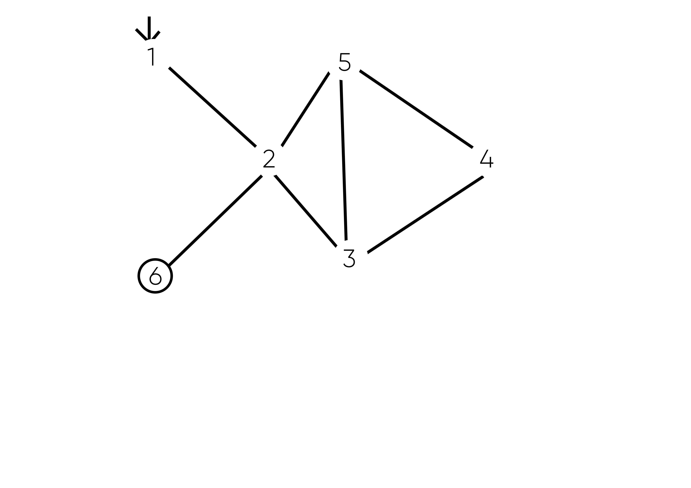
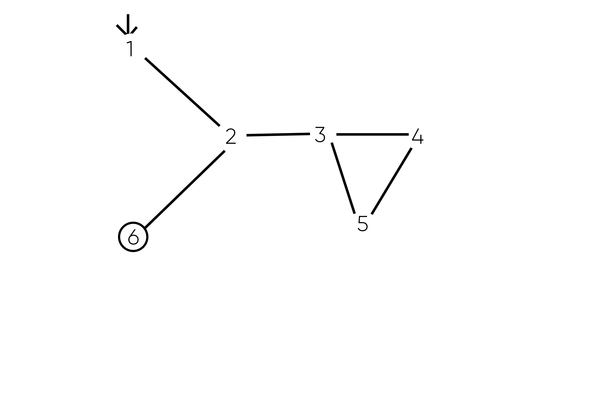

# Exercise 7.2.3-1
## a) Draw the graph.
* Graph 1:

* Graph 2:

* Graph 3:

* Graph 4:

## b) List all of the du-paths with respect to x
* G1: [1,2,8], [1,2,3,5,6], [4,3,5,6], [4,3,5,7,2,8], [4,3,5,6,7,2,8] 
* G2: [1,2,6], [1,2,3], [3,5,2,3], [3,5,2,6], [3,4,5,2,3], [3,4,5,2,6] 
* G3: [1,2,6], [1,2,3], [1,2,3,5], [4,5], [4,5,2,3], [4,5,2,6] 
* G4: [1,2,6], [1,2,3,5], [1,2,3,4,5], [5,2,6], [5,2,3,5], [5,2,3,4,5]

## c)  Determine which du-paths each test path tours. Write them in a table with test paths in the first column and the du-paths they cover in the second column.
### Graph 1:
| Test path | DU-paths covered                          |
|-----------|-------------------------------------------|
|[1,2,8]     | [1,2,8]                                   |
|[1,2,3,5,7,2,8]      | [1,2,8]                                   |
|[1,2,3,5,6,7,2,8]    | [1,2,8], [1,2,3,5,6]                      |
|[1,2,3,4,3,5,7,2,8]      | [4,3,5,7,2,8]                             |
|[1,2,3,4,3,4,3,5,6,7,2,8]        | [4,3,5,6], [4,3,5,6,7,2,8]                |
|[1,2,3,4,3,5,7,2,3,5,6,7,2,8]        | [4,3,5,6], [4,3,5,7,2,8], [4,3,5,6,7,2,8] |

### Graph 2:
| Test path | DU-paths covered                          |
|-----------|-------------------------------------------|
|[1,2,6]       | [1,2,6]                                   |
| [1,2,3,4,5,2,3,5,2,6]        | [1,2,3], [3,4,5,2,3], [3,5,2,6]           |
| [1,2,3,5,2,3,4,5,2,6]       | [1,2,3], [3,5,2,3], [3,4,5,2,6]           |
| [1,2,3,5,2,6]       | [1,2,3], [3,5,2,6]                        |

### Graph 3:
| Test path | DU-paths covered            |
|-----------|-----------------------------|
|[1,2,3,5,2,6]        | [1,2,3], [1,2,3,5], [1,2,6] |
|[1,2,3,4,5,2,6]        | [1,2,3], [4,5], [4,5,2,6]   |

### Graph 4: 
| Test path | DU-paths covered                           |
|-----------|--------------------------------------------|
| [1,2,6]        | [1,2,6]                                    |
| [1,2,3,4,5,2,3,5,2,6]       | [1,2,3,4,5], [5,2,3,5], [5,2,6]            |
| [1,2,3,5,2,3,4,5,2,6]         | [1,2,3,5], [5,2,3,4,5], [5,2,6]            |

## d) List a minimal test set that satisfies all defs coverage with respect to x. (Direct tours only.) If possible, use the given test paths. If not, provide additional test paths to satisfy the criterion.
* G1: [t3, t5] satisfies All-Defs coverage.
* G2: [t4] satisfies All-Defs coverage.
* G3: [t1] satisfies All-Defs coverage.
* G4: [t2] satisfies All-Defs coverage.

## e) List a minimal test set that satisfies all uses coverage with respect to x. (Direct tours only.) If possible, use the given test paths. If not, provide additional test paths to satisfy the criterion.
* G1: [t1, t3, t5] satisfies All-Uses coverage.
* G2: [t1,t2] satisfies All-Uses coverage.
* G3: [t1,t2, [1,2,6],[1,2,3,4,5,2,3,5,2,6]]satisfies All-Uses coverage.
* G4: [t1, t2] satisfies All-Uses coverage.

## f) List a minimal test set that satisfies all du-paths coverage withrespect to x. (Direct tours only.) If possible, use the given test paths. If not, provide additional test paths to satisfy the criterion.
* G1: [t1,t3,t4,t5] satisfies All-Du-Paths Coverage.
* G2: [t1, t2, t3] satisfies All-Du-Paths Coverage.
* G3: [t1,t2, [1,2,6],[1,2,3,4,5,2,3,5,2,6]] satisfies All-DU-Paths Coverage.
* G4: [t1, t2, t3] satisfies All-DU-Paths coverage.
 
