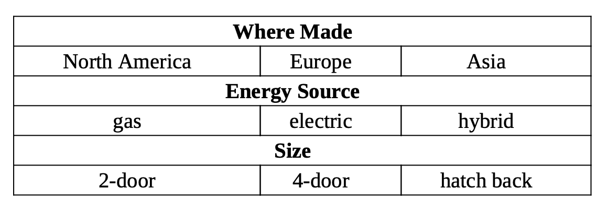

*__Question__: a tester defined three characteristics based on input parameter car: WhereMade, EnergySource, and Size. Find at least 2 mistakes and correct them.*
  

*__Answer:__*
- WhereMade is not completed: Cars can be made in other regions. 
Modification: Add *'Other'*.
    
- Size is not correct. 'HatchBack' can be either '2-door' or '4-door'. 
Modification: Size: *'2-door' - '4-door'*.