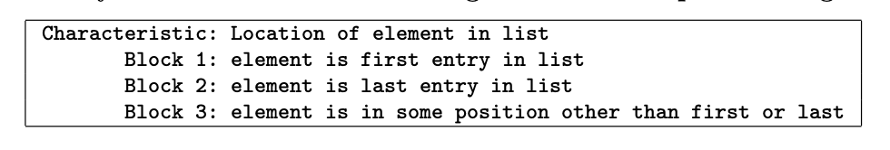

*__Question__: Answer questions about the following table:*

*__Answer:__*

- *a. “Location of element in list” fails the disjointness property. Give an example that illustrates this.*   If the list has only 1 element, then Block 1 and Block 2 will be jointed.  
- *b. “Location of element in list” fails the completeness property. Give an example that illustrates this.*   The element can be null, or not in the list.  
- *c. Supply one or more new partitions that capture the intent of “Location of element in list” but do not suffer from completeness or disjointness problems.*  
    - Block 1: Element is not null and in the list.
    - Block 2: Element is not null and not in the list.
    - Block 3: Element is null.