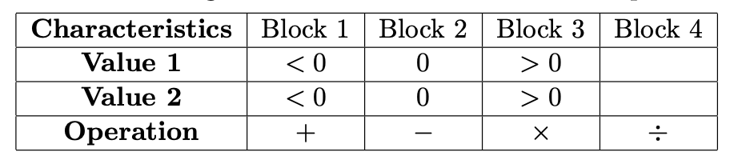

*__Question:__ Use the following characteristics and blocks for the questions below.*

*__Answer:__*
- *a. Give tests to satisfy the *Each Choice* criterion.*   There are 4 tests needed:  *(-2, -2, +), (0, 0, -), (2, 2, x), (2, 2, /)*  
- *b. Give tests to satisfy the Base Choice criterion. Assume base choices are *Value 1* = > 0, *Value 2* = > 0, and *Operation* = +.*  There are 8 tests needed: *(2, 2, +), (-2, 2, +), (0, 2, +), (2, -2, +) (2, 0, +), (2, 2, -), (2, 2, x), (2, 2, /)*  
- *c. How many tests are needed to satisfy the All Combinations criterion?*  There are 36 tests (3 x 3 x 4).  
- *d. Give tests to satisfy the Pair-Wise Coverage criterion.*  There are 12 tests:  *(-2, -2, +), (-2, 0, -), (-2, 2, x), (2, -2, /), (2, 0, +), (0, 2, -), (0, -2, x), (0, 0, /), (0, 2, +), (2, -2, -), (2, 0, x), (-2, 2, /)*
