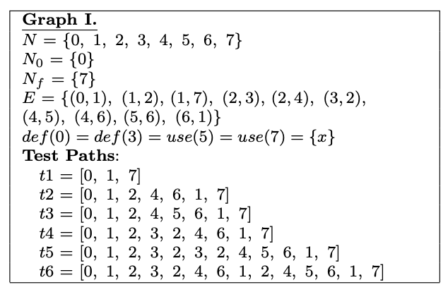

*__Question:__ Given the graph below, answer questions.*

*__Answer:__*
- *b. List all of the du-paths with respect to x.*  
  x has 5 du-paths:
  - (1) [0, 1, 7]
  - (2) [0, 1, 2, 4, 5]
  - (3) [3, 2, 4, 5]
  - (4) [3, 2, 4, 6, 1, 7]
  - (5) [3, 2, 4, 5, 6, 1, 7]
      
- *c. For each test path, determine which du-paths that test path tours.*  
  - t1: direct: (1)
  - t2: sidetrip: (1)
  - t3: direct: (2) - sidetrip: (1)
  - t4: direct: (4) - sidetrip: (1)
  - t5: direct: (3, 5) - sidetrip: (1, 2)
  - t6: sidetrip: (1, 2, 3, 4, 5)
      
- *d. List a minimal test set that satisfies all defs coverage with respect to x.*  
{t1, t4}
    
- *e. List a minimal test set that satisfies all uses coverage with respect to x.*  
  {t1, t3, t5}
    
- *f. List a minimal test set that satisfies all du-paths coverage with respect to x.*  
  {t1, t3, t4, t5}
    