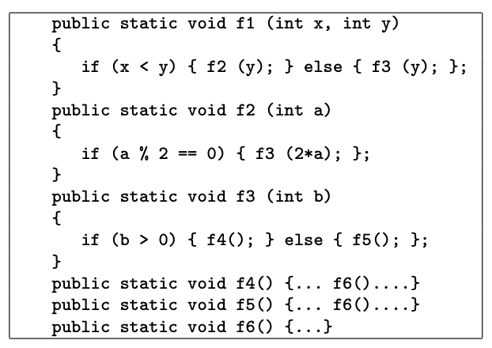

*__Question:__ Answer the questions based on following program fragment.*

*Use the following test inputs:*
- t1 = f1 (0, 0)
- t2 = f1 (1, 1)
- t3 = f1 (0, 1)
- t4 = f1 (3, 2)
- t5 = f1 (3, 4)

*__Answer:__*

- *b. Give the path in the graph followed by each test.*  
    - t1: [f1, f3, f5, f6]
    - t2: [f1, f3, f4, f6]
    - t3: [f1, f2] 
    - t4: [f1, f3, f4, f6]
    - t5: [f1, f2, f3, f4, f6]
  
- *c. Find a minimal test set that achieves Node Coverage.*  
{t1, t2, t3}
    
  
- *d. Find a minimal test set that achieves Edge Coverage.*  
  {t1, t5}
    
  
- *e. Give the prime paths in the graph. Give the prime path that is not covered by any of the test paths above.*  
    [f1, f2, f3, f4, f6]  [f1, f2, f3, f5, f6]  [f1, f3, f4, f6]  [f1, f3, f5, f6]
