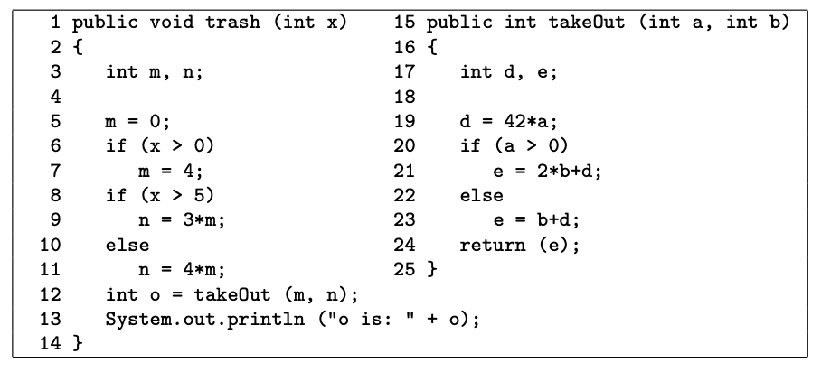

*__Question:__ Use the following methods trash() and takeOut() to answer questions.*

*__Answer:__*
- *a. Give all call sites using the line numbers given.*  
Line 12: trash() → takeOut()
    
  
- *b. Give all pairs of last-defs and first-uses.*  
    - (trash(), m, 5) → (takeOut(), a, 19) 
    - (trash(), m, 7) → (takeOut(), a, 19)
    - (trash(), n, 9) → (takeOut(), b, 21) 
    - (trash(), n, 9) → (takeOut(), b, 23)
    - (trash(), n, 11) → (takeOut(), b, 21)
    - (trash(), n, 11) → (takeOut(), b, 23) 
    - (takeOut(), e, 21) → (trash(), o, 13) 
    - (takeOut(), e, 23) → (trash(), o, 13)
      
      
- *c. Provide test inputs that satisfy all-coupling-uses (note that trash() only has one input).*  
  - x = 0: satisfies 1, 6, 8
  - x = 1: satisfies 2, 5, 7
  - x = 6: satisfies 2, 3, 7

