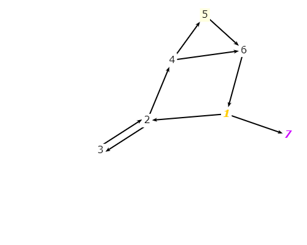

#Excercisee 7.2.2-5
###The graph defined by the following sets:
- ####N = {1, 2, 3, 4, 5, 6, 7}
- ####N0 = {1}
- ####Nf = {7}
- #####E = {(1, 2), (1, 7), (2, 3), (2, 4), (3, 2), (4, 5), (4, 6), (5, 6), (6, 1)}

###a) Draw the graph.

###b) List the test requirements for Edge-Pair Coverage.
Edge-Pair Coverage: {(1,2,3),(1,2,4),(1,7),(2,3,2),(2,4,5),(2,4,6),(3,2,3),(3,2,4),(4,5,6),(4,6,1),(5,6,1),(6,1,2),(6,1,7)}

###c) Does the given set of test paths satisfy Edge-Pair Coverage? If not, state what is missing.
No, the missing edge-pair are:
- The test path p1 misses (2,3,2), (3,2,3), (3,2,4), (2,4,6) and (4,6,1)
- The test path p2 misses (2,4,5) and (4,5,6)
- The test path p3 misses (4,6,1) and (2,4,6)
###d)Consider the simple path [3, 2, 4, 5, 6] and test path [1, 2, 3, 2, 4, 6, 1, 2, 4, 5, 6, 1, 7]. Does the test path tour the simple path directly? With a sidetrip? If so, write down the sidetrip.
- Because [3, 2, 4, 5, 6] dont appear directly in [1, 2, 3, 2, 4, 6, 1, 2, 4, 5, 6, 1, 7] so the test path does not tour the simple path directly
- It tours the simple path with a sidetrip. The side trip is [4,6,1,2,4], because the order of node 2,4,5 doesn't change.
###e) List the test requirements for Node Coverage, Edge Coverage, and Prime Path Coverage on the graph.
- Test requirements for Node Coverage :{1,2,3,4,5,6,7}
- Test requirements for Edge coverage :{(1,2), (1,7), (2,3), (2,4), (3,2), (4,5), (4,6), (5,6), (6,1)}
- Test requirements for Prime path coverage :{[3,2,4,5,6,1,7],[2,4,5,6,1,2],[1,2,4,5,6,1],[3,2,4,6,1,7],[5,6,1,2,4,5],[6,1,2,4,5,6],[4,5,6,1,2,4],[4,5,6,1,2,3],[2,4,6,1,2],[1,2,4,6,1],[6,1,2,4,6],[4,6,1,2,3],[4,6,1,2,4],[3,2,3],[2,3,2]}
###f) List test paths from the given set that achieve Node Coverage but not Edge Coverage on the graph.
- Test paths from the given set that achieve Node Coverage but not Edge Coverage on the graph is p3, p3 doesn't have (4,6)
###g) List test paths from the given set that achieve Edge Coverage but not Prime Path Coverage on the graph.
- There are no path like that.

