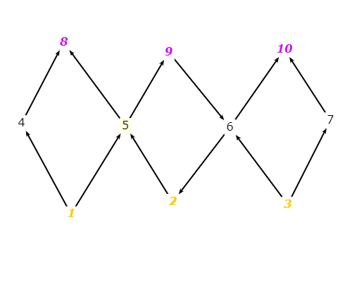

#Excercise 7.2.2-6
### Answer questions a–c for the graph in **Figure 7.2**

###a) List the test requirements for Node Coverage, Edge Coverage, and Prime Path Coverage on the graph.
- Test requirements for Node Coverage :{1,2,3,4,5,6,7,8,9,10}
- Test requirements for Edge coverage :{(1,4), (1,5), (2,5), (3,6), (3,7), (4,8), (5,8), (5,9), (6,2), (6,10), (7,10), (9,6)}
- Test requirements for Prime path coverage :{[2,5,9,6,10], [3,6,2,5,8], [2,5,9,6,2], [1,5,9,6,2], [1,5,9,6,10], [3,6,2,5,9], [9,6,2,5,8], [9,6,2,5,9], [6,2,5,9,6], [5,9,6,2,5], [1,4,8], [1,5,8], [3,6,10], [3,7,10]}

###b) List test paths that achieve Node Coverage but not Edge Coverage on the graph.
- The test set that contain every test paths that achieve Node Coverage is: {[1,4,8], [2,5,9,6,10], [3,7,10]}
- The test set above is not Edge Coverage because it doesn't have edges (3,6), (6,10), (2,6), (5,8)

###c) List test paths that achieve Edge Coverage but not Prime Path Coverage on the graph.
1. [1,4,8]
2. [1,5,9,6,10]
3. [2,5,9,6,10]
4. [3,6,10]
5. [3,7,10]
6. [1,5,9,6,2,5,8]

Those test paths above achieve Edge Coverage but not Prime Path Coverage on the graph because they don't have the prime path [3,6,2,5,8], [2,5,9,6,2], [1,5,8], [5,9,6,2,5], [6,2,5,9,6], [9,6,2,5,9], [3,6,2,5,9], [1,5,9,6,10]