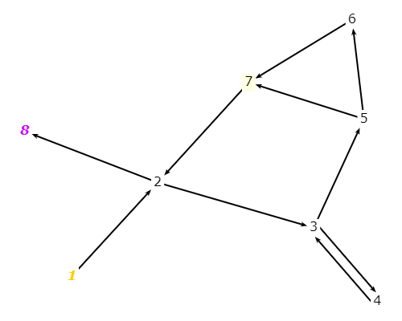
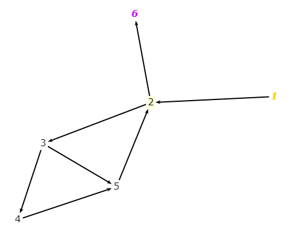
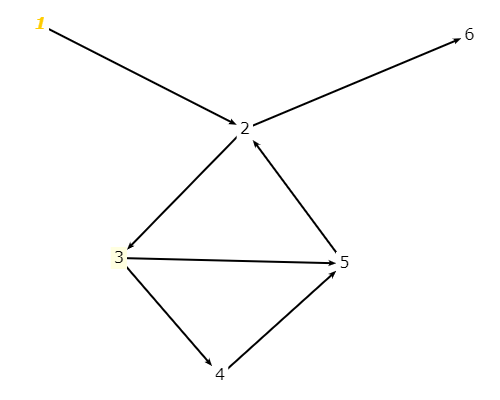
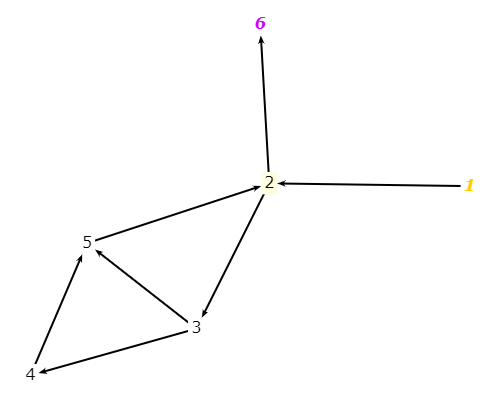

# Excercise 7.2.3-1
###Below are four graphs, each of which is defined by the sets of nodes,initial nodes, final nodes, edges, and defs and uses. Each graph also contains some test paths. Answer the following questions about each graph.

###a) Draw the graph.
Graph 1:

Graph 2:

Graph 3:

Graph 4:

###b) List all of the du-paths with respect to x. (Note: Include all du-paths, even those that are subpaths of some other du-path).
**Graph 1:**
- dup1 [1, 2, 8]
- dup2 [1, 2, 3, 5, 6]
- dup3 [4, 3, 5, 6]
- dup4 [4, 3, 5, 7, 2, 8]
- dup5 [4, 3, 5, 6, 7, 2, 8]

**Graph 2:**
- dup1 [1,2,6]
- dup2 [1,2,3]
- dup3 [3,5,3]
- dup4 [3,4,5,3]

**Graph 3:**
- Graph 3 doesn't have ending note, so we can't make test paths to satisfy the coverage.

**Graph 4:**
- dup1 [1,2,6]
- dup2 [1,2,3,5]
- dup3 [1,2,3,4,5]

