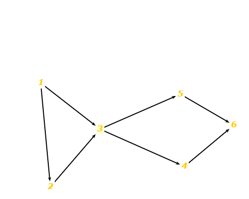

# Excercise-7.4-3
###Use the following program fragment for questions a–e below.

```
public static void f1 (int x, int y)
{
  if (x < y) { f2 (y); } else { f3 (y); };
}
public static void f2 (int a)
{
  if (a % 2 == 0) { f3 (2*a); };
}
public static void f3 (int b)
{
  if (b > 0) { f4(); } else { f5(); };
}
public static void f4() {... f6()....}
public static void f5() {... f6()....}
public static void f6() {...}
```

###a) Draw the call graph for this program fragment.


###b) Give the path in the graph followed by each test.
- t1: [f1, f3, f5, f6]
- t2: [f1, f3, f4, f6]
- t3: [f1, f2]
- t4: [f1, f3, f4, f6]
- t5: [f1, f2, f3, f4, f6]

###c) Find a minimal test set that achieves Node Coverage.
- Three possibilities: {t1, t2, t3}, {t1, t3, t4}, or {t1, t5}.
###d) Find a minimal test set that achieves Edge Coverage.
- One possibility: {t1, t5}
###e) Give the prime paths in the graph. Which prime path is not covered by any of the tests above?
There are 4 prime paths:
1. [f1, f2, f3, f4, f6]
2. [f1, f2, f3, f5, f6]
3. [f1, f3, f4, f6]
4. [f1, f3, f5, f6]

The second of these paths is not covered by the
given test paths.
